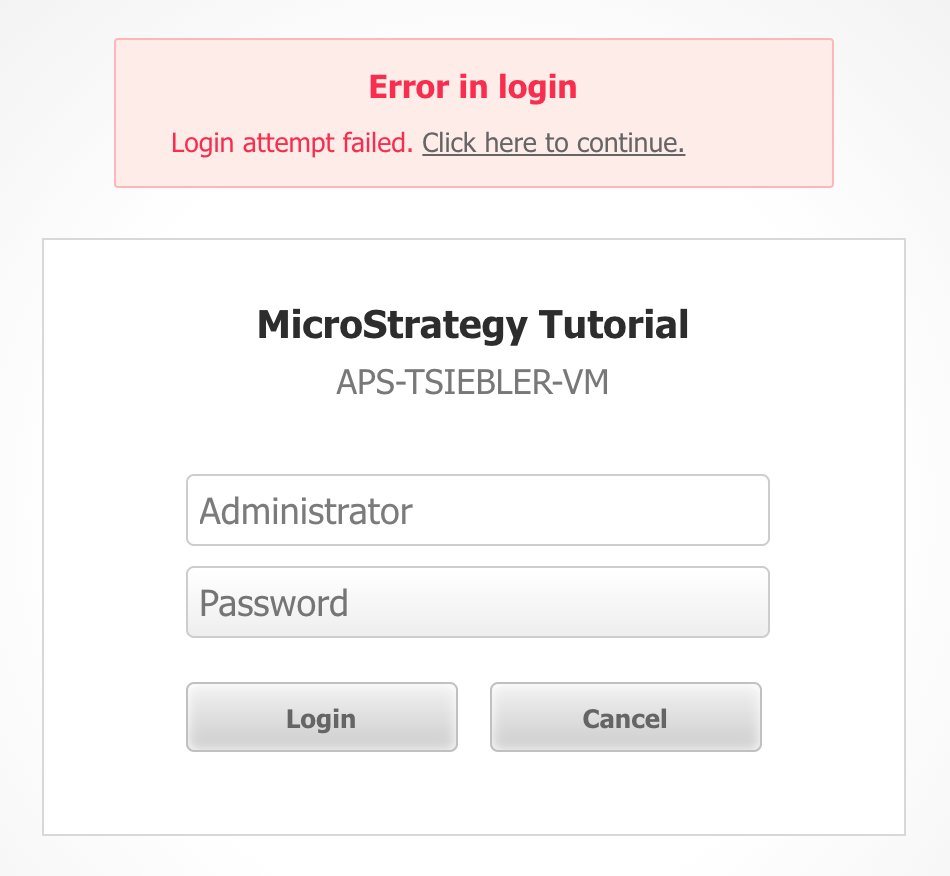

# Custom Error HTML

## Purpose
The messages shown for many errors in MicroStrategy Web can be customized using MessagesBundle files and the errors.xml in the Web Customization Editor:
https://community.microstrategy.com/s/article/KB32648-How-to-customize-error-messages-coming-from-the

However, many of these messages coming from MessagesBundle files can only be replaced with other plaintext messages. Rich messages (such as HTML links) cannot be used here and are always rendered in plaintext.

## Approach
This customization is in two parts:
- Replace the plaintext error with a unique identifier that can easily be found & identified programmatically.
    - This is done using the MessagesBundle files, changing `Login Failure.` to `#errorLogin1`.
- Execute javascript when the page finishes loading, to find the `mstrWeb_error` div on the page DOM, and replace this placeholder if found.
    - This is done using the `global.js` file which will load on every page in MicroStrategy Web.

## Result
A custom error with HTML contents:

